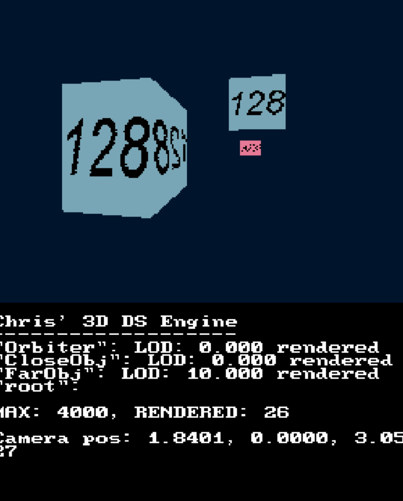

# Nintendo DS Scenegraph Renderer

## About

This is a functional scenegraph renderer made in C++ using LIBNDS and OpenGL made to run on the DeSmuME DS emulator
This renderer includes:
- Entity component system
- Scene graph tree where parent transforms are applied to children
- Controllable camera
- Level Of Detail based on euclidian distance
- Textured and Colored meshes
- Frustum culling
- Linearly interpolated animations
- A virtual input system

## How do I compile it?
1) Clone the project to any local directory
2) Ensure you have devKitArm properly set up (https://devkitpro.org/wiki/Getting_Started)
3) Run <code>make</code> at the project's root
4) You should be presented with a <code>.nds</code> file.

## How do I run the ROM? (Thanks for including it in the project course Chris, you're such a nice guy!)
1) Open DeSmuME (Made for v0.9.13)
2) Navigate to <code>File -> Open ROM...</code> and select the <code>.nds</code> file wherever it is on your machine
3) Enjoy!

## Controls (For PC Emulators)
- <code>Z</code>: Move camera backwards along it's direction axis
- <code>X</code>: Move camera forwards along it's direction axis
- <code>LEFT</code>: Rotate camera left
- <code>RIGHT</code>: Rotate camera right
